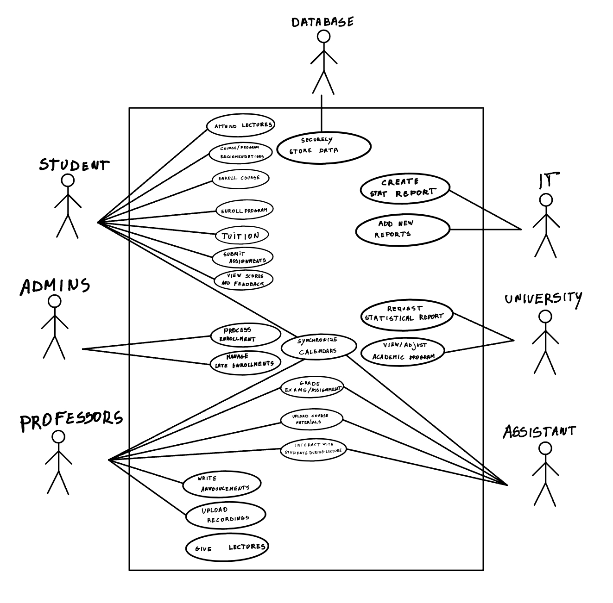

# Part 1

### Identify all actors.

Based on the document, the identified actors are:
1. Students
2. Administrative Aids
3. Professors
4. Assistants
5. University (for program review and adjustments)
6. IT-Department (developers)
7. Database

### Identify 20 use cases.
1. Students enroll in a program.
2. Students enroll in courses.
3. Administrative Aids process enrollment applications.
4. Students receive notifications of enrollment status.
5. Students pay tuition.
6. Students receive suggestions for programs and courses.
7. Professors upload lecture recordings.
8. Professors livestream lectures.
9. Professors upload course materials and announcements.
10. Professors and Assistants interact with students during lectures.
11. Students, Professors, and Assistants synchronize schedules with digital calendars.
12. Assistants create assignments.
13. Students view and submit assignments.
14. Plagiarism detection on student assignments.
15. Students view their scores and feedback.
16. Assistants and Professors grade assignments and exams.
17. University adjusts and reviews programs.
18. IT-Department creates statistical reports.
19. IT-Department adds new types of reports.
20. Data securely stored and managed.

### Responsibilities for each actor.
1. **Students**: 
   - Enroll in programs and courses.
   - Pay tuition.
   - Attend lectures and complete assignments.
   - View their scores and feedback.
   
2. **Administrative Aids**:
   - Process enrollment applications.
   - Approve or decline late enrollments.
   
3. **Professors**:
   - Deliver lectures (upload recordings or livestream).
   - Provide course materials and announcements.
   - Grade exams.
   
4. **Assistants**:
   - Create and grade assignments.
   - Provide supplementary material for assignments.
   - Interact with students during lectures.
   
5. **University**:
   - Review and adjust academic programs.
   - Require statistical reports for decision making.
   
6. **IT-Department**:
   - Develop and maintain the platform.
   - Create and manage statistical reports.
     
7. **Database**
   - Securely store data

### Goals for each actor linked to use cases.
1. **Students**:
   - Enroll in programs and courses (Use Cases: 1, 2).
   - Pay tuition (Use Case: 5).
   - Attend lectures and complete assignments (Use Cases: 7, 8, 13).
   - View their scores and feedback (Use Case: 15).
   
2. **Administrative Aids**:
   - Process enrollment applications (Use Cases: 3, 4).
   - Approve or decline late enrollments (Implied from text).
   
3. **Professors**:
   - Deliver lectures (Use Cases: 7, 8).
   - Provide course materials and announcements (Use Case: 9).
   - Grade exams (Use Case: 16).
   
4. **Assistants**:
   - Create and grade assignments (Use Cases: 12, 16).
   - Provide supplementary material for assignments (Implied from text).
   - Interact with students during lectures (Use Case: 10).
   
5. **University**:
   - Review and adjust academic programs (Use Case: 17).
   - Require statistical reports for decision making (Use Case: 18).
   
6. **IT-Department**:
   - Create and manage statistical reports (Use Cases: 18, 19).

7. **Database**
   - Securely store data

### Use case diagram

### Scenarios
| Student enrolls in a program |  |
| --- | --- |
| **Audience** | System development team |
| **Level** | Specific functionality |
| **Granularity** | Detailed |
| **Preconditions** | Student has an account on the platform. There is an administrative aid linked to each program to process enrollments. |
| **Success condition** | Student is enrolled in the program they chose and enrollment is send to the correct administrative aid. If the deadline has passed, there should have been approval from an administrative aid |
| **Fail condition** | Student can enroll in a program after the deadline without approval from a administrative aid. Student cannot enroll in a program before the deadline. An enrollment is not send or send to the wrong administrative aid. Administrative aid cannot give approval for late enrollments. |
| **Primary actors** | Student |
| **Secondary actors** | Administrative aids |
| **Trigger** | Student enrolls |

| **Plagiarism detection on student assignments** ||
| --- | --- |
| **Audience** | System development team |
| **Level** | Specific Functionality |
| **Granularity** | Detailed |
| **Preconditions** | Assignments have been submitted and the deadline is closed |
| **Succes condition** | The plagiarism detection program runs after the deadline and checks the chance the student committed plagiarism|
| **Fail condition** | The plagiarism detection software fails to find if a student has committed plagiarism |
| **Primary actors** | Professor, assistant |
| **Secondary actors** | |
| **Trigger** |The deadline of an assignment has passed |

### Step by step description of execution of Plagiarism detection on student assignments
| Step | Action |
| --- | --- |
| 1 | Deadline of an assignment has passed |
| 2 | The system retrieves the submitted assignments from the server |
| 3 | For each assignment that is returned from the server : |
| 3.1 | The system calculates the similarity scores and adds it to the plagiarism report |
| 3.2 | If the systems find a similarity above a certain threshold it flags the assignment |
| 4 | The system generates a plagiarism report and attaches it to the assignments |
| 5 | The system notifies the professor / teaching assistant of the flagged assignments |
| **Branch** | Exceptions |
| Any | If the system fails or crashes it should notify the software devolpment team with an error log |
| After 2 | If there are no submissions, the system should stop running |

## User story cards

### Plagiarism detection
   *As a professor I want all the assignments to be checked by plagiarism detection software and a report of it attached to the assignment. This way academic integrity is ensured.*
#### INVEST criteria
1. I: Independent: 
    This story does not mention/depend on any other story
2. N: Negotiable:
    There isnt a lot of detail of how/when the software should run. 
3. V: Value:
    The story specifies the value: academic integrity 
4. E: Estimable:
    It's clear what has to be done
5. S: Small:
    The story describes a single functionality
6. T: Testable:
    We can easily define acceptance criteria for this user story.
 
 ## Questions for the customer:
* From what grade of similarity with outside sources should assignments be flagged as "potentially plagiarized"
* Do we use this system to ask approval of the administrative aid when a student is late for enrollment, or is this a completely different system?